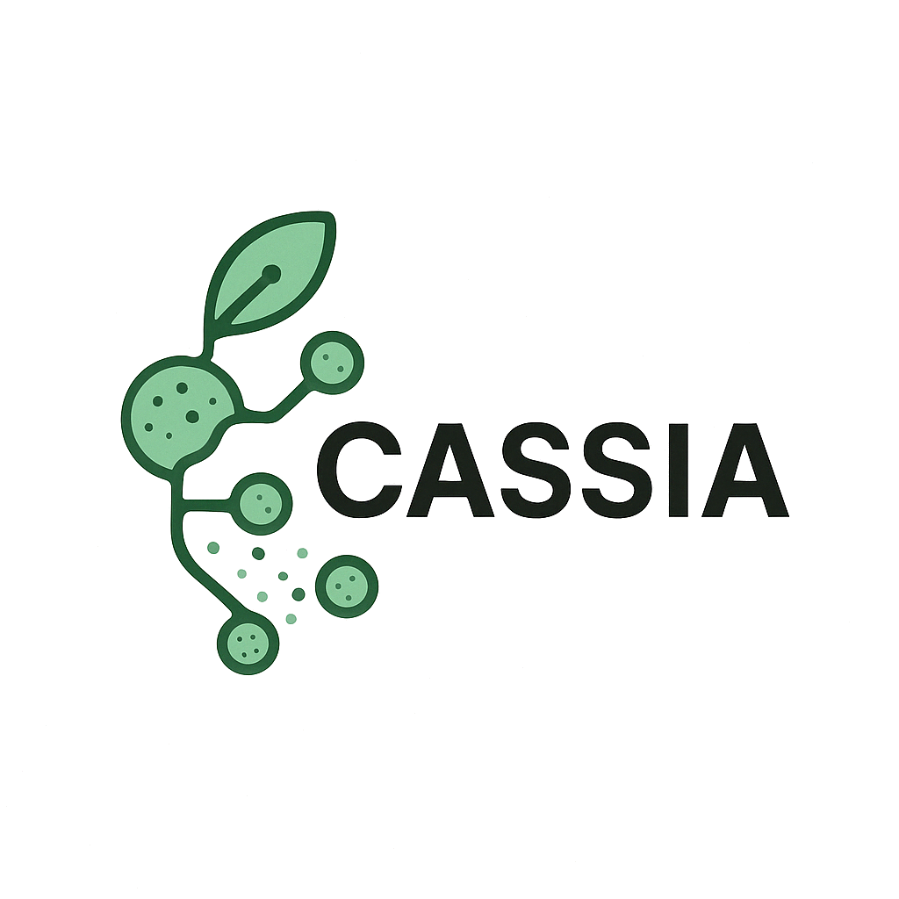

<div align="center">



[English](README.md) | [中文](README_CN.md)

</div>

CASSIA 是一个基于multi-agent多智能体的大型语言模型工具，用于快速，准确，简单地进行单细胞的可解释分群注释。

🌐 [体验 CASSIA 网页界面](https://cassiacell.com/) - 仅提供最基础的CASSIA功能

📝 [R 工作流示例](https://github.com/ElliotXie/CASSIA/blob/main/CASSIA_example/CASSIA_tutorial_final.Rmd)

📚 [完整 R 文档/英文版](https://documentationeng.vercel.app/)

📚 [完整 R 文档/中文版](https://cassia-documentation-cn.vercel.app/)

📝 [Python 工作流示例](https://github.com/ElliotXie/CASSIA/blob/main/CASSIA_example/CASSIA_python_tutorial.ipynb)

🤖 [模型注释能力排行榜](https://sc-llm-benchmark.com/methods/cassia)


## 📰 更新

> **2025-04-19**  
> 🔄 **CASSIA 添加了重试机制和优化的报告存储！**  
> 最新更新引入了失败任务的自动重试机制，并优化了报告的存储方式，使访问和管理更加便捷。  
> 🎨 **完成CASSIA标志设计！**

> **2025-04-17**  
> 🚀 **CASSIA 现在支持自动单细胞注释基准测试！**  
> 最新更新引入了一个新功能，可以实现完全自动化的单细胞注释基准测试。结果由 LLMs 自动评估，性能与人类专家相当。  
> **专门的基准测试网站即将推出—敬请期待！**


## 🏗️ 安装 (R 语言)

GitHub 安装
```R
# 安装依赖
install.packages("devtools")
install.packages("reticulate")

# 安装 CASSIA
devtools::install_github("ElliotXie/CASSIA/CASSIA_R")
```

### 🔑 设置 API

设置api大概需要2分钟时间，我们建议从 OpenRouter 开始，因为它可以仅通过单个 API 就访问市面上大多数大模型。大规模应用则推荐使用 OpenAI 或 Anthropic 直接访问更加稳定。

请注意，在某些国家，OpenAI 和 Anthropic 可能被禁止。在这些情况下，用户可以使用 OpenRouter 代替。

```R
# 对于 OpenAI
setLLMApiKey("your_openai_api_key", provider = "openai", persist = TRUE)

# 对于 Anthropic
setLLMApiKey("your_anthropic_api_key", provider = "anthropic", persist = TRUE)

# 对于 OpenRouter
setLLMApiKey("your_openrouter_api_key", provider = "openrouter", persist = TRUE)
```


- **API 提供商指南:**
	- [如何获取 OpenAI API 密钥](https://platform.openai.com/api-keys)
	- [如何获取 Anthropic API 密钥](https://console.anthropic.com/settings/keys)
	- [如何获取 OpenRouter API 密钥](https://openrouter.ai/settings/keys)
    - [OpenAI API 文档](https://beta.openai.com/docs/)
    - [Anthropic API 文档](https://docs.anthropic.com/)
    - [OpenRouter API 文档](https://openrouter.ai/docs/quick-start)


## 🧬 示例数据

CASSIA 包含两种格式的示例标记数据：
```R
# 加载示例数据
markers_unprocessed <- loadExampleMarkers(processed = FALSE)  # Seurat findallmarkers 输出文件
markers_processed <- loadExampleMarkers(processed = TRUE)     # 处理后格式，包含两列数据：cluster_name 和 gene_list
```

## ⚙️ 快速一键使用

```R
runCASSIA_pipeline(
    output_file_name,     # 输出文件的基本名称
    tissue,               # 组织类型（例如，"brain"）
    species,              # 物种（例如，"human"）
    marker,               # 来自 findallmarker 的标记数据
    max_workers = 4,      # 并行工作者数量 (根据电脑cpu核心数调整)
    annotation_model = "gpt-4o",                    # 注释模型
    annotation_provider = "openai",                 # 注释提供商
    score_model = "anthropic/claude-3.5-sonnet",    # 评分模型
    score_provider = "openrouter",                  # 评分提供商
    annotationboost_model="anthropic/claude-3.5-sonnet", # 注释增强模型
    annotationboost_provider="openrouter", # 注释增强提供商
    score_threshold = 75,                          # 最低可接受分数
    additional_info = NULL                         # 额外需要添加的细胞类型信息
)
```

## 🤖 支持的模型

用户可以为注释和评分选择任何模型。下面列出了一些经典模型。大多数当前流行的模型都可以通过 OpenRouter 调用。


### OpenRouter
- `deepseek/deepseek-chat-v3-0324`：非常经济实惠且表现与 GPT-4o 相当，最推荐使用
- `anthropic/claude-3.5-sonnet`：可以绕过claude的访问限制
- `openai/gpt-4o-2024-11-20`：可以绕过openai的访问限制

### OpenAI
- `gpt-4o`（推荐）：性能和成本平衡
- `o1-mini`：高级推理能力（成本更高）

### Anthropic
- `claude-3-5-sonnet-20241022`：高性能模型 （在论文测试中效果最佳）
- `claude-3-7-sonnet-latest`：最新高性能模型模型

## 📤 输出

流程生成四个关键文件：
1. 初始注释结果
2. 带推理的质量评分
3. 详细注释报告
4. 注释增强报告 （如果有任何评分低于75分的注释，则会自动生成注释增强报告）

## 🧰 故障排除

### 身份验证（错误 401）
```R
# 检查 API 密钥是否正确设置
key <- Sys.getenv("ANTHROPIC_API_KEY")
print(key)  # 输出结果不应该为空

# 如果需要，重置 API 密钥
setLLMApiKey("your_api_key", provider = "anthropic", persist = TRUE)
```

### 文件错误
- 必要时使用绝对路径
- 检查文件权限
- 确保文件未在其他程序中打开

### 最佳实践
- 保持 API 密钥安全
- 维持足够的 API Credit

注意：此 README 仅涵盖了基本的 CASSIA 功能。有关包括高级功能和详细示例在内的完整教程，请访问：
[CASSIA 完整教程](https://cassia-true-final-4.vercel.app/)。

## 📖 引用

📖 [最新预印本 (v2, 最新版)](https://www.biorxiv.org/content/10.1101/2024.12.04.626476v2)
 
📖 [原始预印本 (v1, 历史版本)](https://www.biorxiv.org/content/10.1101/2024.12.04.626476v1)

CASSIA: a multi-agent large language model for reference free, interpretable, and automated cell annotation of single-cell RNA-sequencing data  
Elliot Xie, Lingxin Cheng, Jack Shireman, Yujia Cai, Jihua Liu, Chitrasen Mohanty, Mahua Dey, Christina Kendziorski  
bioRxiv 2024.12.04.626476; doi: https://doi.org/10.1101/2024.12.04.626476 

## 📬 联系方式

如有任何问题或需要帮助，欢迎随时邮件联系我们，我们一定会尽力协助：
**xie227@wisc.edu** 
如果您觉得我们的项目对您有帮助，请留下一个⭐~ 或者将项目分享给你的朋友，感激不尽！
