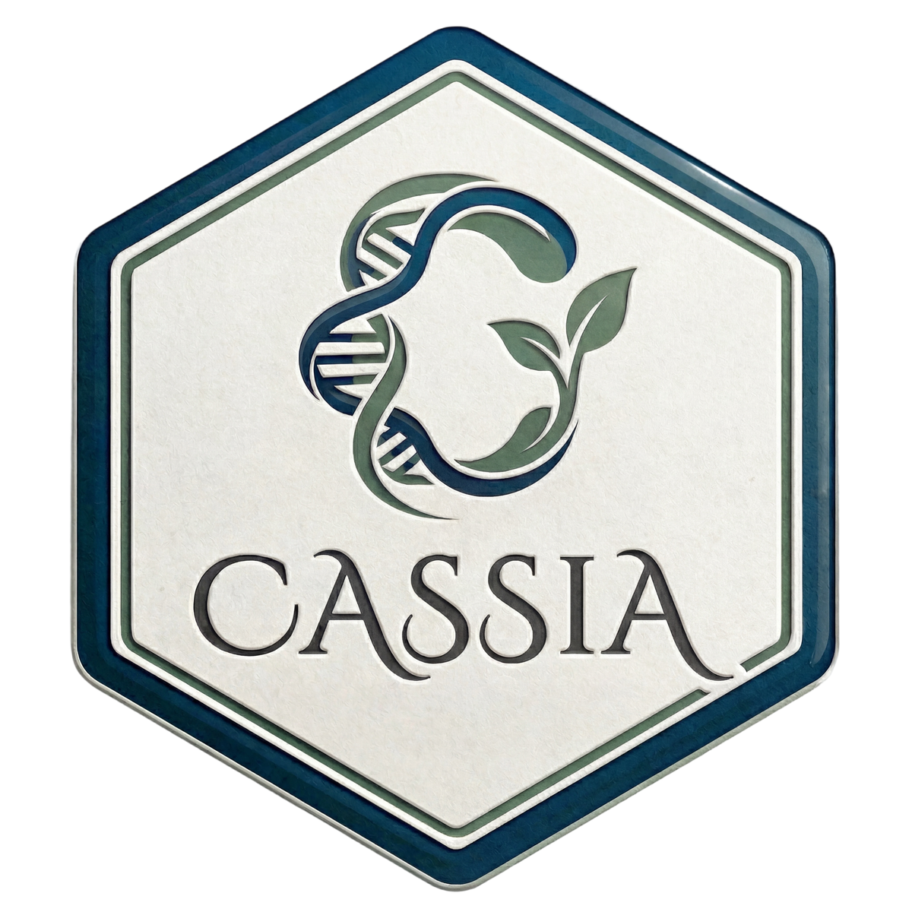

<div align="center">



[English](README.md) | [中文](README_CN.md)

</div>

**CASSIA** (Collaborative Agent System for Single-cell Interpretable Annotation) is a tool that enhances cell type annotation using multi-agent Large Language Models (LLMs).


🌐 [CASSIA Web UI (cassia.bio)](https://cassia.bio/) - Try CASSIA's core features online. For a comprehensive experience with all advanced features, use our R or Python package.

📚 [Complete Documentation/Vignette (docs.cassia.bio)](https://docs.cassia.bio/en)

🤖 [LLMs Annotation Benchmark (sc-llm-benchmark.com)](https://sc-llm-benchmark.com/methods/cassia)


## 📰 News

> **2026-04-08**
> 🐛 **Bug fix released — please update to the latest version (v1.3.7).**
> A recent change to CASSIA's networking layer introduced an issue that could cause some users to see errors when running annotations. This is now fixed.
> - **R / Python users:** update to **v1.3.7** —
>   `remotes::install_github("ElliotXie/CASSIA/CASSIA_R", force = TRUE, upgrade = "never")`
>   or `pip install --upgrade cassia`
> - **Web users:** open [cassia.bio](https://cassia.bio/) in an incognito window (or clear your browser cache) to pick up the new build.
> - If you still see an error after updating, please open an [issue](https://github.com/ElliotXie/CASSIA/issues).

<details>
<summary>📜 Previous Updates (click to expand)</summary>

> **2025-11-29**
>🎇 **Major update with new features and improvements!**
> - **Python Documentation**: Complete Python docs and vignettes now available
> - **Annotation Boost Improvements**: Sidebar navigation, better reports, bug fixes
> - **Better Scanpy Support**: Fixed marker processing, improved R/Python sync
> - **Symphony Compare Update**: Improved comparison module
> - **Batch Output & Ranking**: Updated HTML output for runCASSIA_batch with new ranking method option
> - **Fuzzy Model Aliases**: Easier model selection without remembering exact names

> **2025-05-05**
> 📊 **CASSIA annotation benchmark is now online!**
> The latest update introduces a new benchmarking platform that evaluates how different LLMs perform on single-cell annotation tasks, including accuracy and cost.
> **LLaMA4 Maverick, Gemini 2.5 Flash, and DeepSeekV3** are the top three most balanced options—nearly free!
> 🔧 A new **auto-merge** function unifies CASSIA output across different levels, making subclustering much easier.
> 🐛 Fixed a bug in the annotation boost agent to improve downstream refinement.

> **2025-04-19**
> 🔄 **CASSIA adds a retry mechanism and optimized report storage!**
> The latest update introduces an automatic retry mechanism for failed tasks and optimizes how reports are stored for easier access and management.
> 🎨 **The CASSIA logo has been drawn and added to the project!**

> **2025-04-17**
> 🚀 **CASSIA now supports automatic single-cell annotation benchmarking!**
> The latest update introduces a new function that enables fully automated benchmarking of single-cell annotation. Results are evaluated automatically using LLMs, achieving performance on par with human experts.
> **A dedicated benchmark website is coming soon—stay tuned!**

</details>


## 🏗️ Installation

```R
# Install dependencies
install.packages("devtools")
install.packages("reticulate")

# Install CASSIA
devtools::install_github("ElliotXie/CASSIA/CASSIA_R")
```

If you have network issues installing from GitHub, you can install from source:

```R
# Install from downloaded source package
install.packages("path/to/CASSIA_1.3.2.tar.gz", repos = NULL, type = "source")
```

Download source package: [CASSIA_1.3.2.tar.gz](https://github.com/ElliotXie/CASSIA/raw/main/CASSIA_source_R/CASSIA_1.3.2.tar.gz)

***Note: If the environment is not set up correctly the first time, please restart R and run the code below***

```R
library(CASSIA)
setup_cassia_env()
```


### 🔑 Set Up API Key

It should take about 3 minutes to get your API key.

**You only need one API key to use CASSIA.** We recommend OpenRouter since it provides access to most models (OpenAI, Anthropic, Google, etc.) through a single API key — no need to sign up for multiple providers.

```R
# For OpenRouter
setLLMApiKey("your_openrouter_api_key", provider = "openrouter", persist = TRUE)

# For OpenAI
setLLMApiKey("your_openai_api_key", provider = "openai", persist = TRUE)

# For Anthropic
setLLMApiKey("your_anthropic_api_key", provider = "anthropic", persist = TRUE)

# For custom OpenAI-compatible APIs (e.g., DeepSeek)
setLLMApiKey("your_deepseek_api_key", provider = "https://api.deepseek.com", persist = TRUE)

# For local LLMs - no API key needed (e.g., Ollama)
setLLMApiKey(provider = "http://localhost:11434/v1", persist = TRUE)
```

> **Custom APIs**: CASSIA supports any OpenAI-compatible API endpoint. Simply use the base URL as the provider parameter.

> **Local LLMs**: For data privacy and zero API costs, use local LLMs like Ollama or LM Studio. No API key required for localhost URLs.


- **API Provider Guides:**
	- [How to get an OpenAI api key](https://platform.openai.com/api-keys)
	- [How to get an Anthropic api key](https://console.anthropic.com/settings/keys)
	- [How to get an OpenRouter api key](https://openrouter.ai/settings/keys)
    - [OpenAI API Documentation](https://beta.openai.com/docs/)
    - [Anthropic API Documentation](https://docs.anthropic.com/)
    - [OpenRouter API Documentation](https://openrouter.ai/docs/quick-start)
    - [DeepSeek API Documentation](https://api-docs.deepseek.com/)
    - [Ollama API Documentation](https://docs.ollama.com/api/introduction)


## 🧬 Example Data

CASSIA includes example marker data in two formats:
```R
# Load example data
markers_unprocessed <- loadExampleMarkers(processed = FALSE)  # Direct Seurat output
markers_processed <- loadExampleMarkers(processed = TRUE)     # Processed format
```

## ⚙️ Quick Start

```R
# Core annotation
runCASSIA_batch(
    marker = markers_unprocessed,                # Marker data from FindAllMarkers
    output_name = "cassia_results",              # Output file name
    tissue = "Large Intestine",                  # Tissue type
    species = "Human",                           # Species
    model = "anthropic/claude-sonnet-4.6",       # Model to use
    provider = "openrouter",                     # API provider
    max_workers = 4                              # Number of parallel workers
)
```

> **Want even better results?** Use `runCASSIA_pipeline()` which adds automatic quality scoring and the AnnotationBoost agent for difficult clusters. See [complete documentation](https://docs.cassia.bio/en) for details.

## 🤖 Supported Models

You can choose any model for annotation and scoring. CASSIA also supports custom providers (e.g., DeepSeek) and local open-source models (e.g., `gpt-oss:20b` via Ollama).

Some classic models are listed below. OpenRouter supports most popular models — feel free to experiment.


### OpenAI
- `gpt-5.4`: Balanced option (Recommended)
- `gpt-4o`: Used in the benchmark

### OpenRouter
- `openai/gpt-5.4`: Best-performing model via OpenRouter (no identity verification needed, unlike direct OpenAI API) (Recommended)
- `anthropic/claude-sonnet-4.6`: Best-performing model via OpenRouter (Recommended)
- `google/gemini-3-flash-preview`: One of the best-performing low-cost models
- `x-ai/grok-4.20-beta`: One of the best-performing low-cost models.

### Anthropic
- `claude-sonnet-4-6`: The latest best-performing model (Most recommended)

### Other Providers
These models can be used via their own APIs. See [Custom API Providers](https://docs.cassia.bio/en/docs/r/setting-up-cassia/#custom-api-providers) for setup.
- `deepseek-chat` (DeepSeek v3.2): High performance, very affordable. Provider: `https://api.deepseek.com`
- `glm-5` (GLM 5): Fast and cost-effective. Provider: `https://api.z.ai/api/paas/v4/`
- `kimi-k2.5` (Kimi K2.5): Strong reasoning capabilities. Provider: `https://api.moonshot.ai/v1`

### Local LLMs
- `gpt-oss:20b`: Can run locally via Ollama. Good for large bulk analysis with acceptable accuracy. See [Local LLMs](https://docs.cassia.bio/en/docs/r/setting-up-cassia/#local-llms-ollama-lm-studio) for setup.

## 📖 Citation

📖 [Read our paper in Nature Communications](https://doi.org/10.1038/s41467-025-67084-x)

Xie, E., Cheng, L., Shireman, J. et al. CASSIA: a multi-agent large language model for automated and interpretable cell annotation. Nat Commun (2025). https://doi.org/10.1038/s41467-025-67084-x

## 📬 Contact

If you have any questions or need help, feel free to email us. We are always happy to help:
**xie227@wisc.edu**
If you find this project helpful, please share it with your friends, and give this repo a star ⭐
Many thanks!
