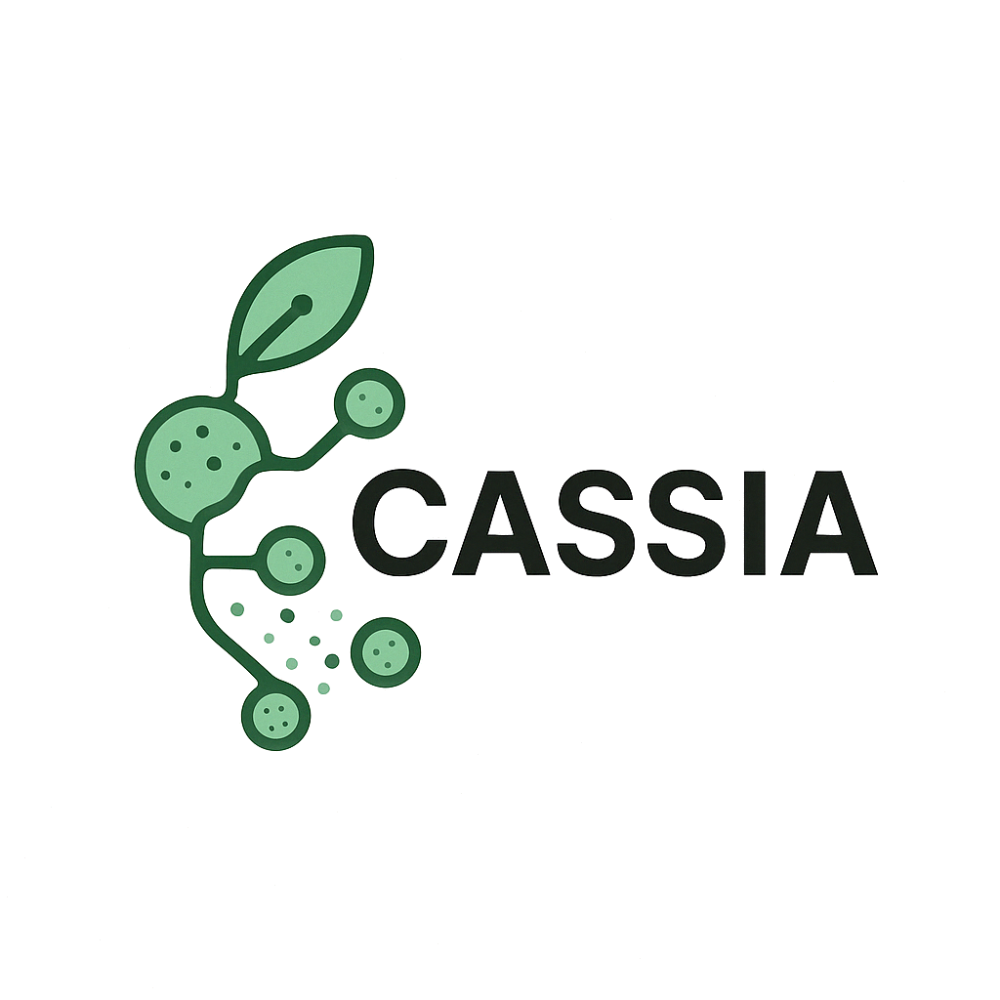

<div align="center">



[English](README.md) | [中文](README_CN.md)

</div>

**CASSIA** 是一个基于multi-agent多智能体的大型语言模型工具，用于快速，准确，简单地进行单细胞的可解释分群注释。

🌐 [体验 CASSIA 网页界面 (cassia.bio)](https://cassia.bio/) - 在线体验 CASSIA 核心功能。如需使用全部高级功能，请安装我们的 R 或 Python 包。

📚 [完整文档及示例/中英文版 (docs.cassia.bio)](https://docs.cassia.bio/zh)

🤖 [模型注释能力排行榜](https://sc-llm-benchmark.com/methods/cassia)


## 📰 更新

> **2025-11-29**
>🎇 **重大更新，新功能和改进！**
> - **Python 文档**：完整的 Python 文档和示例现已上线
> - **注释增强改进**：侧边栏导航、更好的报告、Bug修复
> - **更好的 Scanpy 支持**：修复了标记基因处理问题，改进了 R/Python 同步
> - **Symphony Compare 更新**：改进了比较模块
> - **批量输出和排序**：更新了 runCASSIA_batch 的 HTML 输出，新增排序方法选项
> - **模糊模型别名**：更简便的模型选择，无需记住精确名称

<details>
<summary>📜 历史更新 (点击展开)</summary>

> **2025-05-05**
> 📊 **CASSIA注释基准测试平台现已上线！**
> 本次更新推出了一个全新的基准测试平台，用于评估不同大型语言模型在单细胞注释任务中的表现与成本。
> **LLaMA4 Maverick、Gemini 2.5 Flash 和 DeepSeekV3 是目前性能与成本最均衡的模型，且几乎免费使用！**
> 🔧 新增"自动合并功能"，可统一输出不同层级的细胞类型标签，大幅简化子聚类分析流程。
> 🐛 修复了注释增强代理中的一个错误，提高了低质量注释的优化效果。

> **2025-04-19**
> 🔄 **CASSIA 添加了重试机制和优化的报告存储！**
> 最新更新引入了失败任务的自动重试机制，并优化了报告的存储方式，使访问和管理更加便捷。
> 🎨 **完成CASSIA标志设计！**

> **2025-04-17**
> 🚀 **CASSIA 现在支持自动单细胞注释基准测试！**
> 最新更新引入了一个新功能，可以实现完全自动化的单细胞注释基准测试。结果由 LLMs 自动评估，性能与人类专家相当。
> **专门的基准测试网站即将推出—敬请期待！**

</details>


## 🏗️ 安装

```R
# 安装依赖
install.packages("devtools")
install.packages("reticulate")

# 安装 CASSIA
devtools::install_github("ElliotXie/CASSIA/CASSIA_R")
```

***注意：如果环境第一次没有正确设置，请重启R并运行以下代码***

```R
library(CASSIA)
setup_cassia_env()
```

### 🔑 设置 API 密钥

获取API密钥大约需要3分钟时间。

针对国内用户，我们强烈推荐使用 OpenRouter ，因为OpenAI和Anthropic都对国内访问有限制，使用OpenRouter可以通过单个 API 密钥访问大多数模型。

```R
# 对于 OpenRouter
setLLMApiKey("your_openrouter_api_key", provider = "openrouter", persist = TRUE)

# 对于 OpenAI
setLLMApiKey("your_openai_api_key", provider = "openai", persist = TRUE)

# 对于 Anthropic
setLLMApiKey("your_anthropic_api_key", provider = "anthropic", persist = TRUE)

# 自定义 OpenAI 兼容 API（如 DeepSeek）
setLLMApiKey("your_deepseek_api_key", provider = "https://api.deepseek.com", persist = TRUE)

# 本地 LLM - 无需 API 密钥（如 Ollama）
setLLMApiKey(provider = "http://localhost:11434/v1", persist = TRUE)
```

> **自定义 API**：CASSIA 支持任何 OpenAI 兼容的 API 端点。只需将 API 的基础 URL 作为 provider 参数即可。
> **本地 LLM**：为了数据隐私和零 API 费用，可使用 Ollama 或 LM Studio 等本地 LLM。本地 URL 无需 API 密钥。

- **API 提供商指南:**

	- [如何获取 OpenRouter API 密钥](https://openrouter.ai/settings/keys)
 	- [如何充值OpenRouter](https://zhuanlan.zhihu.com/p/1898753591528908109)


## 🧬 示例数据

CASSIA 包含两种格式的示例标记数据：
```R
# 加载示例数据
markers_unprocessed <- loadExampleMarkers(processed = FALSE)  # Seurat findallmarkers 输出文件
markers_processed <- loadExampleMarkers(processed = TRUE)     # 处理后格式
```

## ⚙️ 流程使用

```R
# 默认提供商设置为OpenRouter

runCASSIA_pipeline(
    output_file_name = "cassia_test",            # Base name for output files
    tissue = "Large Intestine",                   # Tissue type (e.g., "brain")
    species = "Human",              		 # Species (e.g., "human")
    marker = markers_unprocessed,               # Marker data from findallmarker
    max_workers = 4                              # Number of parallel workers
)
```

## 🤖 支持的模型

您可以为注释和评分选择任何模型。CASSIA 还支持自定义提供商（如 DeepSeek）和本地开源模型（如通过 Ollama 运行的 `gpt-oss:20b`）。

下面列出了一些经典模型。OpenRouter 支持大多数流行模型 — 欢迎尝试。


### OpenAI
- `gpt-5.1`: 均衡选择（推荐）
- `gpt-4o`: 用于文章的基准测试

### OpenRouter
- `google/gemini-2.5-flash`: 最好的低费率大模型之一，性能可与gpt-4o媲美（推荐）
- `deepseek/deepseek-chat-v3-0324`: 最好的开源大模型之一，经常给出非常详细的注释
- `x-ai/grok-4-fast`: 最好的低费率大模型之一

### Anthropic
- `claude-sonnet-4-5`: 最新的高性能模型（最推荐）

## 📚 需要帮助？

本 README 仅涵盖 CASSIA 基本功能。如需高级功能、故障排除及详细示例，请访问[完整文档](https://docs.cassia.bio/zh)。

## 📖 引用

📖 [阅读我们在 Nature Communications 上的论文](https://doi.org/10.1038/s41467-025-67084-x)

Xie, E., Cheng, L., Shireman, J. et al. CASSIA: a multi-agent large language model for automated and interpretable cell annotation. Nat Commun (2025). https://doi.org/10.1038/s41467-025-67084-x

## 📬 联系方式

如有任何问题或需要帮助，欢迎随时邮件联系我们，我们一定会尽力协助：
**xie227@wisc.edu**
如果您觉得我们的项目对您有帮助，请留下一个⭐或者将项目分享给你的朋友，感激不尽！
