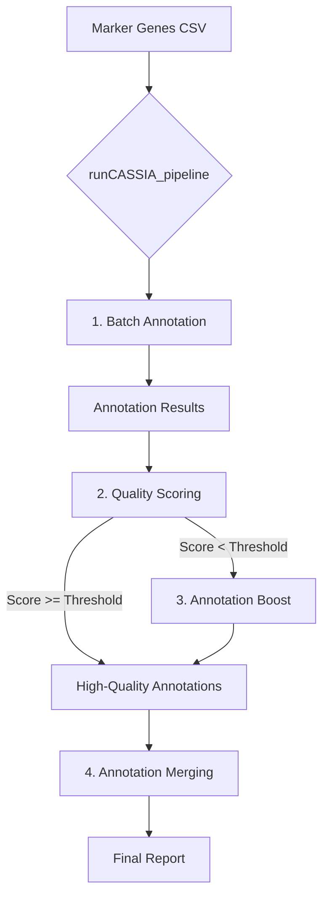

# CASSIA Python Package: Comprehensive Documentation

**Version**: 0.3.1.dev4
**Author**: Elliot Yixuan Xie
**GitHub**: [https://github.com/elliotxe/CASSIA](https://github.com/elliotxe/CASSIA)

---

## 1. Introduction

**CASSIA** (Cell-type Annotation using Single-cell RNA-sequencing and Artificial Intelligence) is a powerful, modular Python package for automated cell type annotation of single-cell RNA sequencing (scRNA-seq) data. It leverages the advanced reasoning capabilities of Large Language Models (LLMs) to interpret marker gene sets, providing accurate and context-aware cell type labels.

This document provides a comprehensive guide to installing, configuring, and using the CASSIA package. It is intended for bioinformaticians, researchers, and developers who wish to use CASSIA for their analysis pipelines or integrate it into other applications, such as a FastAPI web service.

### Key Features:
-   **Modular Workflow**: Run a full end-to-end pipeline or execute specific steps individually.
-   **Multi-Provider Support**: Natively supports OpenAI, Anthropic, OpenRouter, and custom LLM API endpoints.
-   **Annotation Boost**: A deep-dive, iterative agentic workflow to resolve ambiguous or challenging cell clusters.
-   **Uncertainty Quantification**: Assess the stability and reliability of annotations by running multiple stochastic analyses.
-   **Advanced Celltype Comparison**: A "Symphony" mode where multiple LLM agents discuss and debate the identity of closely related cell types.
-   **Automated Reporting**: Generates detailed HTML and CSV reports for easy interpretation of results.

---

## 2. Installation

### 2.1. Prerequisites
- Python 3.8 or higher.

### 2.2. Dependencies
CASSIA requires the following Python packages:
-   `numpy>=1.21.0`
-   `pandas>=1.3.0`
-   `openai>=1.0.0`
-   `anthropic>=0.3.0`
-   `requests>=2.25.0`
-   `matplotlib>=3.3.0`
-   `seaborn>=0.11.0`
-   `tqdm>=4.60.0`

### 2.3. Installation Command
You can install CASSIA directly from PyPI:
```bash
pip install CASSIA
```
Or, for the latest development version, install directly from GitHub:
```bash
pip install git+https://github.com/elliotxe/CASSIA.git
```

---

## 3. Configuration

### 3.1. API Keys
CASSIA requires API keys to communicate with LLM providers. The recommended way to configure them is by setting environment variables.

-   **OpenAI**: `OPENAI_API_KEY`
-   **Anthropic**: `ANTHROPIC_API_KEY`
-   **OpenRouter**: `OPENROUTER_API_KEY`

Alternatively, you can set them programmatically within your script:
```python
import CASSIA

# For OpenAI
CASSIA.set_api_key("your-openai-key", provider="openai")

# For Anthropic
CASSIA.set_api_key("your-anthropic-key", provider="anthropic")

# For OpenRouter
CASSIA.set_api_key("your-openrouter-key", provider="openrouter")

# For a custom provider endpoint
CASSIA.set_api_key("your-custom-key", provider="https://api.deepseek.com")
```

### 3.2. Input Data Format
The primary input for CASSIA is a **marker gene file** in CSV format. This file contains the pre-computed marker genes that distinguish each cell cluster. The file must contain the following columns:

-   `cluster`: A unique identifier for each cell cluster (e.g., "Cluster 1", "0", "monocytes").
-   `gene`: The official gene symbol.
-   `avg_log2FC`: The average log2 fold-change indicating how much more the gene is expressed in the cluster compared to others.
-   `p_val_adj`: The adjusted p-value from the differential expression test.
-   `pct.1`: The percentage of cells within the cluster that express the gene.
-   `pct.2`: The percentage of cells outside the cluster that express the gene.

Here is an example snippet of a marker file:
```csv
cluster,gene,avg_log2FC,p_val_adj,pct.1,pct.2
0,CD79A,4.5,1.2e-98,0.95,0.10
0,CD79B,4.2,1.5e-95,0.94,0.08
1,NKG7,5.1,2.0e-120,0.99,0.15
1,GZMA,4.8,3.0e-115,0.98,0.12
```
The package includes sample marker files in its `data` directory, which can be loaded using `CASSIA.loadmarker()`.

---

## 4. CASSIA Workflow and Core Functions

CASSIA can be executed as a single, all-in-one pipeline or as a series of modular steps.

### 4.1. Workflow Diagram


### 4.2. The All-in-One Pipeline
This is the simplest way to use CASSIA. The `runCASSIA_pipeline` function automates all the core steps.

-   **`CASSIA.runCASSIA_pipeline(...)`**
    -   **Description**: Executes the complete workflow: batch annotation, quality scoring, conditional annotation boosting for low-scoring clusters, and a final merging of annotations.
    -   **Key Parameters**:
        -   `output_file_name` (str): The base name for all generated output files.
        -   `tissue` (str): The tissue context (e.g., "large intestine").
        -   `species` (str): The species context (e.g., "human").
        -   `marker_path` (str | pd.DataFrame): The path to the marker CSV file or a loaded pandas DataFrame.
        -   `annotation_model` / `score_model` / `annotationboost_model` / `merge_model` (str): The specific LLM to use for each step (e.g., "openai/gpt-4o", "anthropic/claude-3.5-sonnet").
        -   `annotation_provider` / `score_provider` / `annotationboost_provider` / `merge_provider` (str): The service provider ("openai", "anthropic", "openrouter", or a custom URL).
        -   `score_threshold` (int): The confidence score threshold (0-100). Any cluster scoring below this will be sent for Annotation Boost. Default: 97.
        -   `merge_annotations` (bool): If `True`, performs the final annotation merging step.
    -   **Usage Example**:
        ```python
        import CASSIA
        
        CASSIA.set_api_key("your-openrouter-key", provider="openrouter")
        
        # Load sample data included with the package
        unprocessed_markers = CASSIA.loadmarker(marker_type="unprocessed")
        
        CASSIA.runCASSIA_pipeline(
            output_file_name="Full_Analysis_Results",
            tissue="large intestine",
            species="human",
            marker_path=unprocessed_markers,
            max_workers=6,
            annotation_model="anthropic/claude-3.5-sonnet",
            annotation_provider="openrouter",
            score_model="anthropic/claude-3.5-sonnet",
            score_provider="openrouter",
            score_threshold=97,
            annotationboost_model="anthropic/claude-3.5-sonnet",
            annotationboost_provider="openrouter",
            merge_annotations=True
        )
        ```

### 4.3. Modular Functions

You can also run each step of the CASSIA workflow independently for greater control.

#### Step 1: Batch Annotation
-   **`CASSIA.runCASSIA_batch(...)`**
    -   **Description**: Takes a marker file and annotates each cluster.
    -   **Returns**: Creates two CSV files: `output_name_full.csv` with detailed logs and `output_name_summary.csv` with just the final annotations.
    -   **Usage Example**:
        ```python
        batch_output_name = "intestine_batch_analysis"
        CASSIA.runCASSIA_batch(
            marker=unprocessed_markers,
            output_name=batch_output_name,
            model="anthropic/claude-3.5-sonnet",
            provider="openrouter",
            tissue="large intestine",
            species="human",
            n_genes=50
        )
        ```

#### Step 2: Quality Scoring
-   **`CASSIA.runCASSIA_score_batch(...)`**
    -   **Description**: Evaluates the confidence of annotations from the batch step.
    -   **Returns**: A new CSV file (`_scored.csv`) with a `CASSIA_Score` column.
    -   **Usage Example**:
        ```python
        scored_output_file = batch_output_name + "_scored.csv"
        CASSIA.runCASSIA_score_batch(
            input_file=batch_output_name + "_full.csv",
            output_file=scored_output_file,
            model="anthropic/claude-3.5-sonnet",
            provider="openrouter"
        )
        ```

#### Step 3: Generate HTML Report
-   **`CASSIA.runCASSIA_generate_score_report(...)`**
    -   **Description**: Creates a user-friendly HTML report from the scored results.
    -   **Returns**: An HTML file visualizing the annotations and scores.
    -   **Usage Example**:
        ```python
        CASSIA.runCASSIA_generate_score_report(
            csv_path=scored_output_file,
            index_name="intestine_report.html"
        )
        ```

---

## 5. Advanced Analysis Modules

CASSIA includes several advanced modules for deeper investigation into your data.

### 5.1. Annotation Boost
-   **`CASSIA.runCASSIA_annotationboost(...)`**
    -   **Description**: An agentic, iterative workflow to resolve ambiguity for a *single cluster*. It generates hypotheses, searches for evidence in the marker data, and refines its conclusions over several iterations. Ideal for clusters with low confidence scores or suspected heterogeneity.
    -   **Key Parameters**:
        -   `full_result_path` (str): Path to the `_full.csv` file from `runCASSIA_batch`.
        -   `marker` (pd.DataFrame): The complete marker gene DataFrame.
        -   `cluster_name` (str): The exact name of the cluster to investigate.
        -   `num_iterations` (int): The number of analytical iterations to perform.
        -   `search_strategy` (str): `"breadth"` (tests multiple hypotheses at once) or `"depth"` (focuses on one hypothesis at a time).
    -   **Returns**: Detailed HTML and raw text reports summarizing the investigation.
    -   **Usage Example**:
        ```python
        CASSIA.runCASSIA_annotationboost(
            full_result_path="intestine_batch_analysis_full.csv",
            marker=unprocessed_markers,
            output_name="monocyte_boost_report",
            cluster_name="monocyte",
            major_cluster_info="Human Large Intestine",
            num_iterations=5,
            model="anthropic/claude-3.5-sonnet",
            provider="openrouter"
        )
        ```

### 5.2. Symphony Compare (Advanced Cell Type Comparison)
-   **`CASSIA.symphony_compare.symphonyCompare(...)`** (also aliased as `compareCelltypes`)
    -   **Description**: A multi-agent framework where different LLM personas "discuss" and score the likelihood of several closely related cell types based on a given set of markers. This is perfect for distinguishing between subtle cell states (e.g., Naive B cell vs. Plasmablast vs. Plasma cell).
    -   **Key Parameters**:
        -   `celltypes` (list[str]): A list of cell type names to be compared.
        -   `marker_set` (str): A comma-separated string of relevant marker genes.
        -   `model_preset` (str): A tier of models to use: `"quality"`, `"budget"`, or `"fastest"`.
        -   `discussion_mode` (bool): If `True`, enables a multi-round debate among the agents.
    -   **Returns**: A detailed HTML report of the debate, individual agent scores, and a final consensus.
    -   **Usage Example**:
        ```python
        # A marker set with genes for B-cells (CD19, PAX5) and Plasma cells (SDC1, IRF4)
        marker_set = "CD19, CD20, PAX5, IRF4, CD38, SDC1"
        cell_types_to_compare = ["Naive B cell", "Plasmablast", "Plasma cell"]

        CASSIA.symphony_compare.symphonyCompare(
            tissue="lymph node",
            species="human",
            celltypes=cell_types_to_compare,
            marker_set=marker_set,
            model_preset="quality",
            discussion_mode=True,
            discussion_rounds=2,
            generate_html_report=True,
            output_file="b_cell_comparison.csv"
        )
        ```

### 5.3. Uncertainty Quantification
-   **`CASSIA.runCASSIA_batch_n_times(...)` & `CASSIA.runCASSIA_similarity_score_batch(...)`**
    -   **Description**: This two-step process assesses annotation stability. First, it runs the batch annotation `n` times with a non-zero `temperature` to introduce stochasticity. Second, it compares the `n` sets of results to compute a consensus score for each cluster.
    -   **Returns**: A CSV file containing similarity scores, indicating how consistent the annotations are across runs.
    -   **Usage Example**:
        ```python
        # Step 1: Run batch analysis n=3 times
        CASSIA.runCASSIA_batch_n_times(
            n=3,
            marker=unprocessed_markers,
            output_name="intestine_uncertainty_run",
            model="anthropic/claude-3.5-sonnet",
            provider="openrouter",
            tissue="large intestine",
            species="human",
            temperature=0.4 # Introduce variability
        )
        
        # Step 2: Calculate similarity scores
        CASSIA.runCASSIA_similarity_score_batch(
            marker=unprocessed_markers,
            file_pattern="intestine_uncertainty_run_*_full.csv",
            output_name="intestine_uncertainty_scores"
        )
        ```

---

## 6. Extensibility: Adding a New LLM Provider

CASSIA is designed to be extensible. You can add support for a new LLM provider by making minimal changes. The logic is handled in `CASSIA/llm_utils.py`.

To add a new provider, you would typically:
1.  **Modify `call_llm` in `llm_utils.py`**: Add a new `elif` condition for your provider.
2.  **Implement the API Call**: Inside the new block, write the code to format the request and handle the response according to the new provider's API specification. This usually involves using the `requests` library.
3.  **Use the new provider**: You can now pass the name of your new provider to the `provider` parameter in any CASSIA function.

**Example**: Adding a fictional "MyLLMProvider".
```python
# In CASSIA/llm_utils.py, inside the call_llm function:
# ... existing code for openai, anthropic, etc.

elif provider == "my_llm_provider":
    # Logic for calling your custom LLM
    api_key = os.environ.get("MY_LLM_API_KEY")
    headers = {"Authorization": f"Bearer {api_key}"}
    payload = {
        "model": model,
        "prompt": conversation_history,
        "temperature": temperature
    }
    response = requests.post("https://api.myllm.com/v1/chat", json=payload)
    response.raise_for_status()
    # Extract the text from the response, which will vary by provider
    llm_response_text = response.json()["choices"][0]["text"]

# ... rest of the function
```

---

## 7. Example: Integrating CASSIA with FastAPI

CASSIA's modular functions are well-suited for a web API. Here is a conceptual outline for a FastAPI application.

### Key Considerations:
-   **Asynchronous Execution**: CASSIA tasks can be slow. Use FastAPI's `BackgroundTasks` or a more robust job queue like Celery to run analysis without blocking the server.
-   **File Management**: Analyses involve reading and writing files. Create a unique job ID for each request to manage input and output files in a dedicated temporary directory.
-   **Configuration**: Use environment variables to manage API keys and other settings, which is standard practice for web applications.

### Conceptual FastAPI Endpoints

```python
# main.py
from fastapi import FastAPI, UploadFile, File, BackgroundTasks
import CASSIA
import pandas as pd
import uuid
import os

app = FastAPI()

# --- Configuration ---
CASSIA.set_api_key(os.environ["OPENROUTER_API_KEY"], provider="openrouter")
BASE_RESULTS_DIR = "./api_results"

# --- Endpoints ---
@app.post("/annotate")
async def annotate_pipeline(background_tasks: BackgroundTasks, file: UploadFile = File(...)):
    """
    Accepts a marker file and runs the full CASSIA pipeline in the background.
    """
    job_id = str(uuid.uuid4())
    job_dir = os.path.join(BASE_RESULTS_DIR, job_id)
    os.makedirs(job_dir, exist_ok=True)
    
    input_path = os.path.join(job_dir, file.filename)
    with open(input_path, "wb") as f:
        f.write(await file.read())

    # Add the long-running CASSIA task to the background
    background_tasks.add_task(
        CASSIA.runCASSIA_pipeline,
        output_file_name=os.path.join(job_dir, "results"),
        marker_path=input_path,
        tissue="user-provided",
        species="human",
        provider="openrouter",
        model="anthropic/claude-3.5-sonnet"
    )
    
    return {"message": "Analysis started in the background.", "job_id": job_id}

@app.get("/results/{job_id}")
def get_results(job_id: str):
    """
    Check the status or get the results of an analysis job.
    """
    job_dir = os.path.join(BASE_RESULTS_DIR, job_id)
    summary_file = os.path.join(job_dir, "results_merged_broad.csv")
    
    if not os.path.exists(summary_file):
        return {"status": "processing"}
        
    results_df = pd.read_csv(summary_file)
    return {"status": "complete", "results": results_df.to_dict(orient="records")}

```
This provides a basic structure for building a robust, scalable web service around CASSIA. 