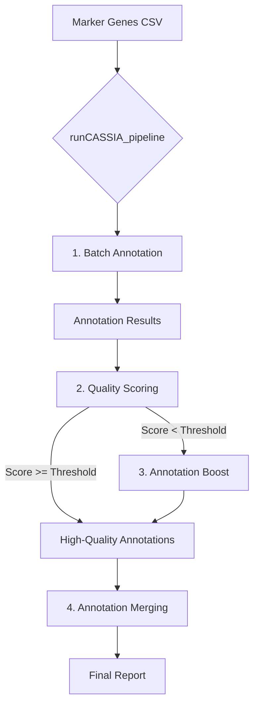

# CASSIA Python Package: Comprehensive Documentation

## 1. Introduction

**CASSIA** (Cell-type Annotation using Single-cell RNA-sequencing and Artificial Intelligence) is a powerful, modular Python package for automated cell type annotation of single-cell RNA sequencing (scRNA-seq) data. It leverages the advanced reasoning capabilities of Large Language Models (LLMs) to interpret marker gene sets, providing accurate and context-aware cell type labels.


### 3.2. Input Data Format
The primary input for CASSIA is a **marker gene file** in CSV format. This file contains the pre-computed marker genes that distinguish each cell cluster. The file must contain the following columns:

-   `cluster`: A unique identifier for each cell cluster (e.g., "Cluster 1", "0", "monocytes").
-   `gene`: The official gene symbol.
-   `avg_log2FC`: The average log2 fold-change indicating how much more the gene is expressed in the cluster compared to others.
-   `p_val_adj`: The adjusted p-value from the differential expression test.
-   `pct.1`: The percentage of cells within the cluster that express the gene.
-   `pct.2`: The percentage of cells outside the cluster that express the gene.

Here is an example snippet of a marker file:
```csv
cluster,gene,avg_log2FC,p_val_adj,pct.1,pct.2
0,CD79A,4.5,1.2e-98,0.95,0.10
0,CD79B,4.2,1.5e-95,0.94,0.08
1,NKG7,5.1,2.0e-120,0.99,0.15
1,GZMA,4.8,3.0e-115,0.98,0.12
```
The package includes sample marker files in its `data` directory, which can be loaded using `CASSIA.loadmarker()`.

---

## 4. CASSIA Workflow and Core Functions

CASSIA can be executed as a single, all-in-one pipeline or as a series of modular steps.

### 4.1. Workflow Diagram


### 4.2. The All-in-One Pipeline
This is the simplest way to use CASSIA. The `runCASSIA_pipeline` function automates all the core steps.

-   **`CASSIA.runCASSIA_pipeline(...)`**
    -   **Description**: Executes the complete workflow: batch annotation, quality scoring, conditional annotation boosting for low-scoring clusters, and a final merging of annotations.
    -   **Key Parameters**:
        -   `output_file_name` (str): The base name for all generated output files.
        -   `tissue` (str): The tissue context (e.g., "large intestine").
        -   `species` (str): The species context (e.g., "human").
        -   `marker_path` (str | pd.DataFrame): The path to the marker CSV file or a loaded pandas DataFrame.
        -   `annotation_model` / `score_model` / `annotationboost_model` / `merge_model` (str): The specific LLM to use for each step (e.g., "openai/gpt-4o", "anthropic/claude-3.5-sonnet").
        -   `annotation_provider` / `score_provider` / `annotationboost_provider` / `merge_provider` (str): The service provider ("openai", "anthropic", "openrouter", or a custom URL).
        -   `score_threshold` (int): The confidence score threshold (0-100). Any cluster scoring below this will be sent for Annotation Boost. Default: 97.
        -   `merge_annotations` (bool): If `True`, performs the final annotation merging step.
    -   **Usage Example**:
        ```python
        import CASSIA
        
        CASSIA.set_api_key("your-openrouter-key", provider="openrouter")
        
        # Load sample data included with the package
        unprocessed_markers = CASSIA.loadmarker(marker_type="unprocessed")
        
        CASSIA.runCASSIA_pipeline(
            output_file_name="Full_Analysis_Results",
            tissue="large intestine",
            species="human",
            marker_path=unprocessed_markers,
            max_workers=6,
            annotation_model="anthropic/claude-3.5-sonnet",
            annotation_provider="openrouter",
            score_model="anthropic/claude-3.5-sonnet",
            score_provider="openrouter",
            score_threshold=97,
            annotationboost_model="anthropic/claude-3.5-sonnet",
            annotationboost_provider="openrouter",
            merge_annotations=True
        )
        ```

### 4.3. Modular Functions

You can also run each step of the CASSIA workflow independently for greater control.

#### Step 1: Batch Annotation
-   **`CASSIA.runCASSIA_batch(...)`**
    -   **Description**: Takes a marker file and annotates each cluster.
    -   **Returns**: Creates two CSV files: `output_name_full.csv` with detailed logs and `output_name_summary.csv` with just the final annotations.
    -   **Usage Example**:
        ```python
        batch_output_name = "intestine_batch_analysis"
        CASSIA.runCASSIA_batch(
            marker=unprocessed_markers,
            output_name=batch_output_name,
            model="anthropic/claude-3.5-sonnet",
            provider="openrouter",
            tissue="large intestine",
            species="human",
            n_genes=50
        )
        ```

#### Step 2: Quality Scoring
-   **`CASSIA.runCASSIA_score_batch(...)`**
    -   **Description**: Evaluates the confidence of annotations from the batch step.
    -   **Returns**: A new CSV file (`_scored.csv`) with a `CASSIA_Score` column.
    -   **Usage Example**:
        ```python
        scored_output_file = batch_output_name + "_scored.csv"
        CASSIA.runCASSIA_score_batch(
            input_file=batch_output_name + "_full.csv",
            output_file=scored_output_file,
            model="anthropic/claude-3.5-sonnet",
            provider="openrouter"
        )
        ```

#### Step 3: Generate HTML Report
-   **`CASSIA.runCASSIA_generate_score_report(...)`**
    -   **Description**: Creates a user-friendly HTML report from the scored results.
    -   **Returns**: An HTML file visualizing the annotations and scores.
    -   **Usage Example**:
        ```python
        CASSIA.runCASSIA_generate_score_report(
            csv_path=scored_output_file,
            index_name="intestine_report.html"
        )
        ```

---

## 5. Advanced Analysis Modules

CASSIA includes several advanced modules for deeper investigation into your data.

### 5.1. Annotation Boost
-   **`CASSIA.runCASSIA_annotationboost(...)`**
    -   **Description**: An agentic, iterative workflow to resolve ambiguity for a *single cluster*. It generates hypotheses, searches for evidence in the marker data, and refines its conclusions over several iterations. Ideal for clusters with low confidence scores or suspected heterogeneity.
    -   **Key Parameters**:
        -   `full_result_path` (str): Path to the `_full.csv` file from `runCASSIA_batch`.
        -   `marker` (pd.DataFrame): The complete marker gene DataFrame.
        -   `cluster_name` (str): The exact name of the cluster to investigate.
        -   `num_iterations` (int): The number of analytical iterations to perform.
        -   `search_strategy` (str): `"breadth"` (tests multiple hypotheses at once) or `"depth"` (focuses on one hypothesis at a time).
    -   **Returns**: Detailed HTML and raw text reports summarizing the investigation.
    -   **Usage Example**:
        ```python
        CASSIA.runCASSIA_annotationboost(
            full_result_path="intestine_batch_analysis_full.csv",
            marker=unprocessed_markers,
            output_name="monocyte_boost_report",
            cluster_name="monocyte",
            major_cluster_info="Human Large Intestine",
            num_iterations=5,
            model="anthropic/claude-3.5-sonnet",
            provider="openrouter"
        )
        ```

### 5.2. Uncertainty Quantification
-   **`CASSIA.runCASSIA_batch_n_times(...)` & `CASSIA.runCASSIA_similarity_score_batch(...)`**
    -   **Description**: This two-step process assesses annotation stability. First, it runs the batch annotation `n` times with a non-zero `temperature` to introduce stochasticity. Second, it compares the `n` sets of results to compute a consensus score for each cluster.
    -   **Returns**: A CSV file containing similarity scores, indicating how consistent the annotations are across runs.
    -   **Usage Example**:
        ```python
        # Step 1: Run batch analysis n=3 times
        CASSIA.runCASSIA_batch_n_times(
            n=3,
            marker=unprocessed_markers,
            output_name="intestine_uncertainty_run",
            model="anthropic/claude-3.5-sonnet",
            provider="openrouter",
            tissue="large intestine",
            species="human",
            temperature=0.4 # Introduce variability
        )
        
        # Step 2: Calculate similarity scores
        CASSIA.runCASSIA_similarity_score_batch(
            marker=unprocessed_markers,
            file_pattern="intestine_uncertainty_run_*_summary.csv",
            output_name="intestine_uncertainty_scores"
        )
        ```